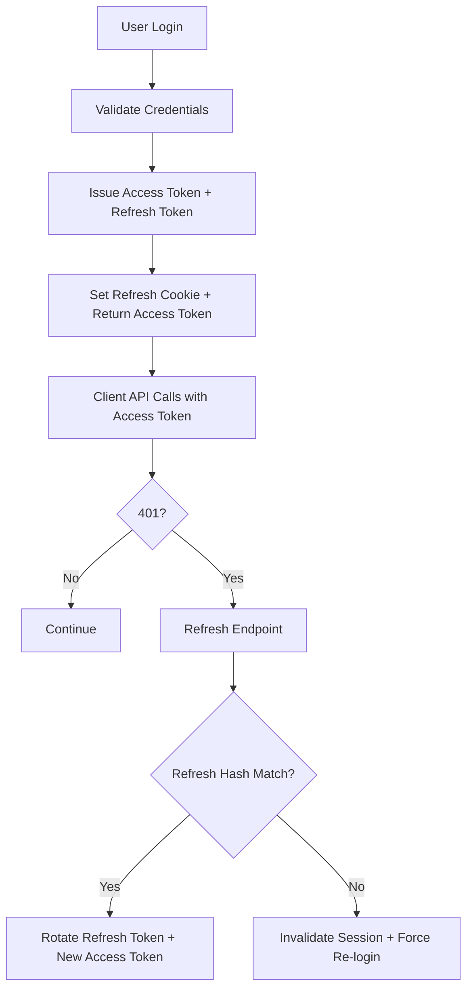
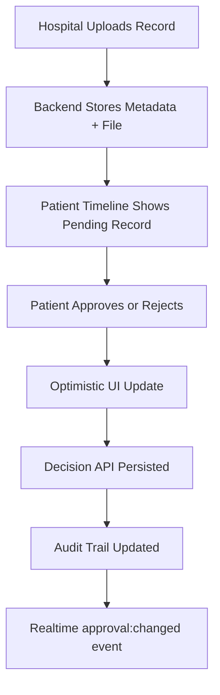
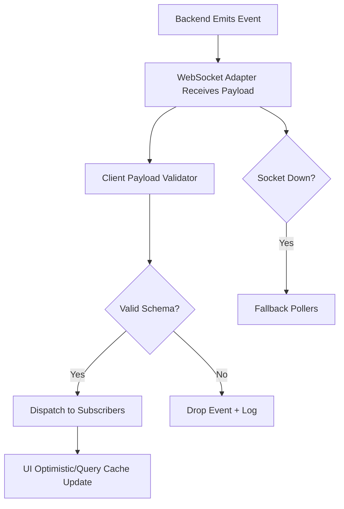

# VitaCollab

Production-oriented healthcare collaboration platform for secure record exchange, patient consent workflows, and real-time event-driven UX.

## Architecture Overview

- Frontend: Next.js App Router, React, TanStack Query, optimistic UI hooks, WebSocket adapter with polling fallback
- Backend: Express + MongoDB, JWT access/refresh auth, Zod validation middleware, role-based authorization
- Storage and media: Cloudinary-first upload flow with local fallback in development
- Observability: structured logger, Sentry-ready exception capture hooks (backend and frontend)

## Tech Decisions

- Real-time safety: all websocket events go through schema validators before processing
- Progressive resilience: socket layer falls back to polling seamlessly
- Security-first auth: refresh token rotation with mismatch invalidation
- Contract clarity: explicit event/payload contracts and QR token resolve APIs

## Auth Flow

## Record Upload to Approval Flow

## Realtime Event Flow

